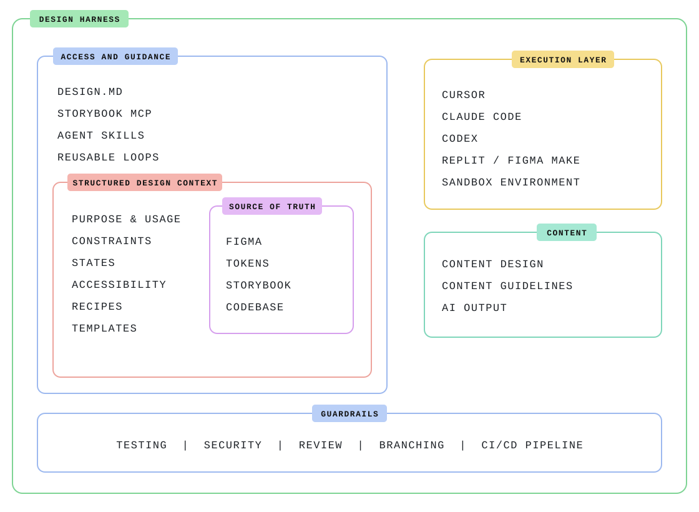

<picture>
  <source media="(prefers-color-scheme: dark)" srcset="assets/banner-dark.svg">
  
</picture>

<p align="center">
  
  
  
  
  
  
  
</p>

A design harness for AI-assisted product design, packaged as Claude Code plugins. The human directs; agents execute inside evidence loops and hard gates.

<p align="center">
  <a href="#install">Install</a> ·
  <a href="#what-you-get">What you get</a> ·
  <a href="#the-map">The map</a> ·
  <a href="#philosophy">Philosophy</a> ·
  <a href="#maintaining-the-harness">Maintaining</a>
</p>

## Why I made this

I'm a product designer, and I built this because raw AI is not usable for real product work — not for designers, not for PMs, not for founders. Point a model at a one-line prompt and you get generic output: invented requirements, hardcoded values, the same interchangeable aesthetic, claims of "done" with nothing verified. The problem was never the model's capability. It's that nobody hands a new team member zero context and expects craft.

This harness is the context. It gives AI what a good team gives a new hire: written direction (art direction, taste rules, a voice), sources of truth it may not contradict (design tokens, Figma variables, the codebase), a process with evidence at every step, and hard gates it cannot talk its way past (token-only styling, WCAG 2.2 AA, performance budgets, "not 100% right = no push-through").

The point is who it's for. Designers direct visual quality without babysitting every prompt — corrections become standing rules that compound. PMs run discovery and validation loops where every feature traces to evidence, not vibes. Founders ship with a full product team's discipline before they can afford the team. You stay the director: the AI executes inside the structure, shows its work, and stops at the decisions that are yours.

One promise runs through everything — every shipped pixel traces back to a real user quote:

```
quote → INS → PROB → FEAT (MoSCoW) → wireframe region → token/Figma value
```

## Install

Four steps, about ten minutes. Steps 1 is once per machine; steps 2–3 are once per project.

### Step 0 — Before you start

You need two things:

1. **Claude Code** — install it if you haven't: `npm install -g @anthropic-ai/claude-code` (or the desktop app), then run `claude` once and log in.
2. **Access to this repo** — it's private for now, so you must be logged into a GitHub account that can see it. Check with `gh auth status`; if that fails, run `gh auth login` first.

### Step 1 — Add the marketplace *(once per machine)*

This tells Claude Code where the plugins live:

```bash
claude plugin marketplace add beeuxd/bee-design-harness
```

### Step 2 — Install the plugins *(once per project)*

`cd` into your project folder (an empty one is fine if you're starting fresh), then:

```bash
claude plugin install harness-core@bee-design-harness --scope project
claude plugin install role-designer@bee-design-harness --scope project
```

- `harness-core` is always required.
- `role-designer` is the default second install. Swap or add roles for what the project needs — shipping code? add `role-engineer`; in discovery? add `role-pm`. See [What you get](#what-you-get) for all seven; you can add more at any time.
- `--scope project` records the install in the project itself, so teammates opening it in Claude Code get prompted to install the same plugins.

> Prefer staying inside a session? The same two steps work as slash commands: `/plugin marketplace add beeuxd/bee-design-harness`, then `/plugin install harness-core@bee-design-harness`.

### Step 3 — Scaffold the project *(once per project)*

Open Claude Code in the project folder and run:

```
/harness-core:scaffold-project
```

It asks one batch of intake questions (project name, aesthetic, existing design system / branding / voice, research material, default theme, which other AI tools you use), then writes the whole document tree: `DESIGN.md`, `CLAUDE.md`, `AGENTS.md`, `docs/`, `design/`, the token pipeline, and the CI gate workflow. Plugins ship the *behaviors*; this step writes the *documents* they operate on.

### Step 4 — Check it worked

| Check | You should see |
|---|---|
| Type `/` in the session | Skills like `/harness-core:insight-loop` and `/harness-core:art-direction` in the list |
| `ls` the project | `DESIGN.md`, `docs/`, `design/tokens.json` |
| Write a hardcoded hex color into a `.tsx` file | The design-system guard flags it immediately — that's the hooks working |

### After installing — what to run first

| Your situation | Start with |
|---|---|
| Any visual work planned | `art-direction` — the taste interview; visual builds refuse to start without it |
| User-facing copy planned | `voice-guide` — same idea, for words |
| You have research material (interviews, tickets, surveys) | `/harness-core:insight-loop` — starts the evidence pipeline |
| None of the above yet | Just start working — the skills route themselves |

### Updating later

```bash
claude plugin marketplace update bee-design-harness
```

Never copy skill files into a project's `.claude/skills/` by hand — that's how drift happens (see [Maintaining](#maintaining-the-harness)).

## What you get

Seven plugins: one core everything depends on, plus six role packs you add as the work demands.

| Plugin | What | Install when |
|---|---|---|
| `harness-core` | The pipeline itself: 5 evidence loops, the 9-skill quality-gate suite, session lifecycle, project scaffold, ticket workflow, token/Figma sync — plus the 7 agents and the guard hooks | Always — every role pack depends on it |
| `role-designer` | The **default** role: design system, a11y, motion, polish, critique, hand-off | Doing design work |
| `role-engineer` | app-bootstrap (Next.js + tokens + Playwright/axe + Storybook), implement from Figma, GSAP, deploy | Shipping code |
| `role-pm` | Discover & validate (feeds the loops), spec & prioritize | Defining product |
| `role-copywriter` | Voice, UX writing, product copy | Words exist |
| `role-marketer` | SEO, CRO, analytics, launch, brand | Growing it, post-ship |
| `role-founder` | Validate, scope ruthlessly, launch, fundraise | Making bets |

<details>
<summary><b>Every skill, by pack</b> (115 total)</summary>

**`harness-core` (28)**
Evidence loops: `insight-loop` · `problem-loop` · `ideation-loop` · `wireframe-loop` · `hifi-gate`
Quality gates: `ship` · `verify-before-done` · `visual-qa` · `a11y-audit` · `performance-check` · `e2e-test` · `design-system-audit` · `review-ux` · `parallel-review`
Session lifecycle: `session-start` · `next-step` · `handoff-summary` · `escalation-protocol`
Foundation: `scaffold-project` · `art-direction` · `taste-retro` · `design-tokens-sync` · `from-figma` · `storybook-component` · `recipe-harvest` · `sync-executor-context` · `setup-kanban` · `write-tickets`

**`role-designer` (15)**
`animate` · `review-animations` · `improve-animations` · `find-animation-opportunities` · `animation-vocabulary` · `awwwards-animations` · `apple-design` · `design-critique` · `design-handoff` · `design-taste-frontend` · `extract-design-system` · `wcag-accessibility` · `imagegen-frontend-web` · `imagegen-frontend-mobile` · `text-to-lottie`

**`role-engineer` (21)**
`app-bootstrap` · `tailwind-design-system` · `better-ui` · `better-accessibility` · `better-colors` · `better-layout` · `better-typography` · `gsap-core` · `gsap-react` · `gsap-scrolltrigger` · `gsap-timeline` · `gsap-plugins` · `gsap-performance` · `gsap-utils` · `vercel-react-best-practices` · `vercel-composition-patterns` · `vercel-react-view-transitions` · `web-design-guidelines` · `review-loop` · `agent-browser` · `deploy-to-vercel`

**`role-pm` (12)**
`user-research` · `usability-testing` · `customer-journey-map` · `opportunity-solution-tree` · `grilling` · `to-prd` · `to-issues` · `triage` · `prototype` · `doc-co-authoring` · `firecrawl` · `wayfinder`

**`role-copywriter` (6)**
`voice-guide` · `copywriting` · `copy-editing` · `ux-writing` · `ux-copy-review` · `internal-comms`

**`role-marketer` (26)**
`brandkit` · `product-launch` · `product-marketing-context` · `content-strategy` · `seo-audit` · `ai-seo` · `programmatic-seo` · `schema-markup` · `page-cro` · `onboarding-cro` · `ab-testing` · `analytics-tracking` · `marketing-psychology` · `pricing-strategy` · `paid-ads` · `ad-creative` · `email-sequences` · `cold-email` · `lead-magnets` · `referral-program` · `churn-prevention` · `competitor-alternatives` · `directory-submissions` · `social-content` · `marketing-ideas` · `ppt-visual-design`

**`role-founder` (7)**
`scoping-cutting` · `measuring-product-market-fit` · `founder-sales` · `fundraising` · `pitch-deck` · `stripe-best-practices` · `ai-product-strategy`

</details>

### The team

`harness-core` ships seven agents — the roles a product team would have, each with its own charter and place in the pipeline. The main session delegates to them; you never manage them directly.

| Agent | Role | What it does | Runs on |
|---|---|---|---|
| `pm` | The Strategist | Requirements, PRDs, scoping, prioritization — owns `docs/prd.md` | session model |
| `researcher` | The Devil's Advocate | Stress-tests PRDs and specs, fact-checks claims with file:line evidence — challenges, never builds | Sonnet (cheap verification) |
| `architect` | The Architect | Information architecture, user flows, states matrices, responsive specs | session model |
| `backend-dev` | The API Architect | API contracts, endpoints, data models — specs for handoff | session model |
| `ui-designer` | The Crafter | Art direction, tokens, Figma alignment, component styling specs — the taste keeper | session model |
| `frontend-engineer` | The Builder | React/TypeScript to the house standard: token-only, both themes, WCAG 2.2 AA, within budget | session model |
| `qa` | The Gatekeeper | Playwright E2E per feature + the ship gate's verification lenses — honest pass/fail with evidence | Sonnet (cheap verification) |

A feature flows through them in order: **pm** defines → **researcher** challenges → **architect** structures → **backend-dev** specs the API → **ui-designer** applies the visual system through `hifi-gate` → **frontend-engineer** builds via `from-figma` → **qa** verifies → `/ship`.

## The map

Everything in this repo is one of these six blocks — guidance the agents read, context they must honor, truth they may not contradict, executors that do the work, the content layer, and the guardrails that catch what slips through:

<picture>
  <source media="(prefers-color-scheme: dark)" srcset="assets/harness-map-dark.svg">
  
</picture>

## Philosophy

The whole model is written in one document: `harness-core/skills/scaffold-project/templates/DESIGN.md`. In short — the human directs through layered intent (standing taste rules, per-feature priorities, per-iteration corrections); agents report in flight-manifest form with honest confidence; loops exit only on your verdict; and hard gates refuse to proceed regardless of agent confidence: token-only styling, hifi-gate's "not 100% right = no push-through", WCAG 2.2 AA, the performance budget, mobile-first at 360–1920px in both themes.

## Maintaining the harness

For anyone changing this repo (mostly future Bee):

- **Install, never copy.** Skills reach projects only via the plugin install. Copying SKILL.md files into a project's `.claude/skills/` creates silent drift the moment the harness improves — this exact failure was caught in the field on 2026-08-14 (`logs/repairs-core.md`).
- **Test after every change.** `./test-harness.sh` validates manifests, frontmatter, name collisions, dangling references, template completeness, and executes the guard hooks against violation payloads. Pass a project path (`./test-harness.sh ~/my-project`) to also detect copy drift. All green or don't ship.
- **Version on change.** Bump the plugin `version` in `.claude-plugin/plugin.json` when its skills change, so installed projects can see they're behind.
- **Log restorations.** Anything revived from the legacy archive gets its references repaired, an entry in `logs/repairs-*.md`, and the RETIRED list in `test-harness.sh` updated. `logs/CURATION.md` is the provenance record — start there for provenance; the license audit itself is `logs/license-audit-2026-08.md`.

**Status:** harness-core complete (28 skills, 4 hooks, 7 agents) · all six role packs built · guardrails complete (agent-run gate suite + its CI twin in `.github/workflows/gates.yml`).

## License

Original work (harness-core, agents, hooks, templates, docs, and all unattributed skills) is [MIT](LICENSE). Imported skills keep their upstream licenses — each declares `source:` and `license:` in its frontmatter, aggregated in [THIRD-PARTY-NOTICES.md](THIRD-PARTY-NOTICES.md). Firecrawl's AGPL-3.0 skill and Anthropic's proprietary document skills (`pdf`/`docx`) are deliberately not bundled; the `firecrawl` skill here is an original pointer to the official distribution. Skills without a resolved upstream are dispositioned in `logs/license-audit-2026-08.md` before any public release.

---

<p align="center">
  <sub>Made by <a href="https://github.com/beeuxd">Bee</a> — a designer teaching AI the difference between generated and designed.</sub>
</p>
